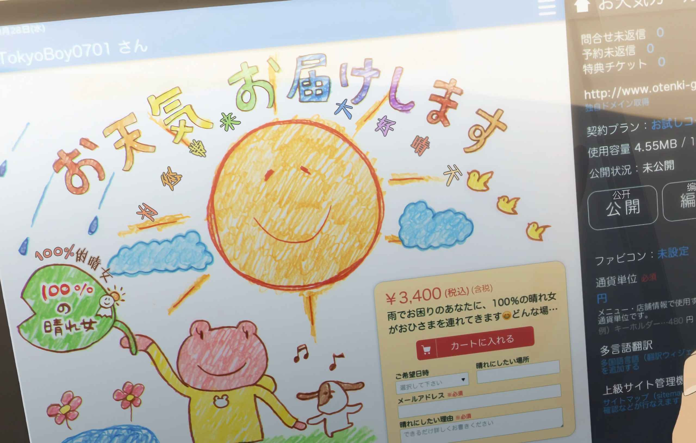

# Otenki Girl - 晴女委托下单网站


> 电影《天气之子》中晴女委托网站的复刻实现




## 项目简介

本项目是基于电影《天气之子》中晴女委托下单菜单网站的复刻实现。用户可以通过网站提交晴女委托，选择希望晴朗的日期和地点，并说明需要晴朗的理由。所有委托记录会保存在本地存储中，用户可以查看和取消委托。

## 功能特性

- 响应式设计：完美支持 PC 端和移动端
- 委托下单：填写昵称、日期、地点和理由提交委托
- 委托列表：查看所有提交的委托记录
- 取消委托：支持取消已提交的委托
- 本地存储：委托数据持久化保存在浏览器 localStorage
- 动态日期选择：自动生成未来 3 天的可选时间段
- 精美 UI：还原电影中的视觉风格

## 技术栈

- 框架：Vue 3.5.26 (Composition API)
- 语言：TypeScript 5.9.3
- 构建工具：Vite 7.3.0
- CSS 预处理器：Less 4.5.1
- 代码格式化：Prettier 3.7.4
- 开发工具：Vue DevTools 8.0.5

## 快速开始

### 环境要求

- Node.js ^20.19.0 或 >=22.12.0
- npm 或 yarn

### 安装依赖

```bash
npm install
```

### 开发模式

```bash
npm run dev
```

访问 http://localhost:5173 查看项目

### 构建生产版本

```bash
npm run build
```

### 预览生产版本

```bash
npm run preview
```

### 类型检查

```bash
npm run type-check
```

### 代码格式化

```bash
npm run format
```

## 项目结构

```
otenki-girl/
├── public/                 # 静态资源
│   └── logo.ico           # 网站图标
├── src/
│   ├── assets/            # 资源文件
│   │   ├── avatar.png     # 用户头像
│   │   ├── back_bottom_left.jpg  # PC端背景图
│   │   ├── back_top.jpg   # PC端顶部背景图
│   │   ├── mobile_back.jpg  # 移动端背景图
│   │   ├── menu.svg       # 菜单图标
│   │   └── 购物车.svg     # 购物车图标
│   ├── components/        # 组件
│   │   └── BookContainer.vue  # 委托下单表单组件
│   ├── App.vue            # 根组件
│   └── main.ts            # 入口文件
├── .gitignore            # Git 忽略配置
├── .prettierrc.json      # Prettier 配置
├── index.html            # HTML 模板
├── package.json          # 项目配置
├── tsconfig.json         # TypeScript 配置
├── tsconfig.app.json     # 应用 TypeScript 配置
├── tsconfig.node.json    # Node TypeScript 配置
├── vite.config.ts        # Vite 配置
└── README.md             # 项目文档
```

## 核心功能说明

### 委托下单流程

1. 用户填写委托表单：
   - 选择希望日期和时间（自动生成未来 3 天的 10:00 和 14:00 选项）
   - 输入希望晴朗的地点（可选）
   - 填写昵称（必填）
   - 填写晴朗理由（必填）
2. 点击"カートに入れる"按钮提交委托
3. 委托信息保存到 localStorage
4. 页面刷新显示最新委托列表

### 委托管理

- 查看委托：在页面下方查看所有已提交的委托
- 取消委托：鼠标悬停在委托卡片上，点击"キャンセル"按钮取消委托
- 数据持久化：所有委托数据保存在浏览器 localStorage 中

### 响应式布局

- PC 端（宽度 >= 880px）：双栏布局，左侧背景图，右侧委托表单
- 移动端（宽度 < 880px）：单栏布局，背景图在上，委托表单在下

## 开发说明

### 添加新功能

1. 在 `src/components/` 目录下创建新组件
2. 在 `src/App.vue` 中引入并使用组件
3. 使用 TypeScript 定义接口和类型
4. 遵循现有的代码风格和命名规范

### 样式开发

- 使用 Less 预处理器编写样式
- 使用 scoped 样式避免样式冲突
- 遵循响应式设计原则，添加移动端适配

### 数据存储

当前使用 localStorage 存储委托数据，数据结构如下：

```typescript
interface BookingData {
  id: string              // 唯一标识
  datetime: string        // 日期时间
  location: string        // 地点
  nickname: string        // 昵称
  reason: string          // 理由
  price: string          // 价格
  createdAt: string      // 创建时间
}
```

## 浏览器支持

- Chrome (最新版本)
- Firefox (最新版本)
- Safari (最新版本)
- Edge (最新版本)

## 关于作者

作者：[GEORGEWU](https://georgewu.top)
博客：[Blog - GEORGEWU](https://blog.georgewu.top)
邮箱：[dormcraft@outlook.com](mailto:dormcraft@outlook.com)
Github：[GEORGEWWWU](https://github.com/GEORGEWWWU)

## 许可证

MIT License

## 致谢

本项目灵感来源于电影《天气之子》（天気の子），致敬新海诚导演的这部优秀作品。

---

如有问题或建议，欢迎提交 Issue 或 Pull Request！
